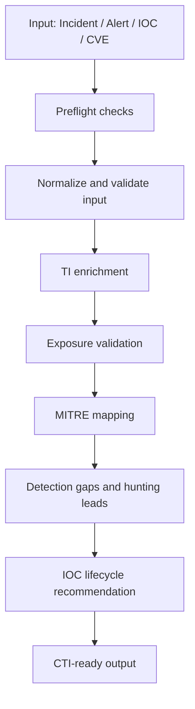

# CTI Investigation Playbook

A practical Cyber Threat Intelligence (CTI) playbook for **incident triage, IOC enrichment, tenant exposure validation, hunting leads, and IOC lifecycle decisions** using Microsoft Sentinel and Microsoft Defender XDR workflows. The playbook is designed to stay analyst-friendly, default to read-only investigation, and produce structured output that can feed SOC triage and detection engineering.[web:53][web:55]

## What it does

- Accepts inputs such as incident ID, alert ID, IOC, actor, campaign, or CVE.
- Enriches indicators using Microsoft-native threat intelligence sources.
- Validates tenant exposure using Defender XDR and Sentinel telemetry.
- Produces MITRE ATT&CK mapping, detection gaps, hunting leads, and lifecycle recommendations.
- Supports autonomous read-only investigation with explicit guardrails for write actions.

## Workflow



GitHub supports Mermaid diagrams in Markdown, which makes this a simple way to visualize the playbook flow directly in the repository.[web:106][web:109]

## Repository structure

- `cti-investigation-playbook*.md` — main playbook versions.
- `Invoke-IncidentWriteback.ps1` — local write-back helper for approved incident comments, tags, and validation checks.
- `README.md` — repository overview and usage guide.

## Usage

Use a short prompt such as:

```text
Triage and validate incident 226 using the CTI investigation playbook stored in cti-investigation-playbook.md.
```

The playbook is intended to expand short prompts into a full investigation flow: retrieve incident context, extract IOCs, enrich, validate exposure, assess detections, and return a structured CTI summary.

## Design principles

- Read-only by default.
- Best-effort completion when some telemetry sources are unavailable.
- Clear separation between evidence, inference, and recommendation.
- No automatic blocking or write-back unless explicitly approved.
- Output optimized for SOC analysts and detection engineers.

These principles align with common incident response playbook practices: clear initiating conditions, defined process steps, and human oversight for higher-risk actions.[web:53][web:55]


## Security considerations

This playbook was designed with simple, practical security guardrails:

- **Read-only by default** — investigation, enrichment, hunting, and exposure validation can run without changing tenant state.
- **Explicit approval for writes** — blocking, indicator ingestion, tagging, classification changes, and incident write-back should only occur when explicitly requested or approved by policy.
- **Preflight checks first** — validate workspace access, telemetry availability, retention, and permissions before trusting no-hit results.
- **Best-effort with transparency** — if a source is unavailable, the playbook continues where possible and records the resulting confidence limitation.
- **IOC validation before enrichment** — normalize and validate IPs, domains, URLs, and hashes before TI lookups to reduce false positives.
- **Evidence over assumption** — separate confirmed findings from inference, and avoid overclaiming attribution or exposure.
- **Current schema awareness** — prefer modern Sentinel TI tables and current Defender action semantics where available.
- **Auditability** — any approved write-back should be verified and treated as complete only after confirmation.
- **Human-in-the-loop for risk decisions** — containment, blocking, and broader incident response actions remain analyst-controlled.

These controls reflect common incident response playbook expectations such as prerequisites, workflow, checklist-driven execution, defined decision points, and documented reporting requirements.[web:61][web:53][web:57]

## Recommended companion files

For a production-quality repository, add:

- `SECURITY.md` — so security issues can be reported through a defined channel.[web:102][web:103][web:110]
- `LICENSE` — to make reuse terms explicit.
- Example prompts or sample outputs — to show expected investigation behavior.

## Scope

This repository is best suited for:

- IOC-rich incidents.
- Identity, phishing, SaaS, or suspicious access investigations.
- CTI-driven triage where enrichment and exposure validation matter.
- Security teams using Microsoft Sentinel and Microsoft Defender XDR.

It is not intended to replace full incident response procedures for containment, eradication, or recovery.
